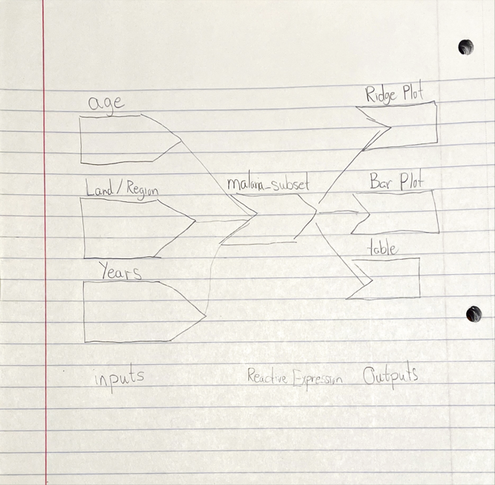

To run the app use this line:
shiny::runGitHub(repo = "Matthewvoss8/stat479_Repo2MatthewVoss","rstudio")
To see the code itself go to https://github.com/Matthewvoss8/stat479_Repo2MatthewVoss and look at the app.R file. Also, someone told me you will need to have the ggridges library activated otherwise it will have a problem.


Discussion: 
1. One of the more unexpected finding for this project was the sheer lack of progress made in reducing the deaths of children under the age of 5 from malaria in Sub-Saharan Africa. I know this region has had some problems with improving its infrastructure, but this was really depressing to see even just 6 years ago there was still mostly deaths from children under the age of 5. Another unexpected find was a rather steep increase in malaria deaths in some Sub-Saharan Arican countries such as in Angola. In Angola particularly one can see a huge increase in deaths even with under 5 between ~2000 and ~2009. One would hope the trend would be decreasing with all groups, but the under 5 group in particular. 

2. I used the sidebar layout function to split the app first between the user inputs and the actual plots and data frame. Here I added inputs the user has access to such as the age group and country selector boxes and also a slider to control the year. For the main layout, I thought putting each output under separate tabs would be helpful since the plot tab uses geom_grid which would push the table further and further down. There was not too much data wrangling before creating the final data frame except for removing the rows with zero deaths in them as they made the country/region list even longer and weren't really helpful. I had to use pivot_wider to create the data.table for the test of independence. On the source page's website: https://ourworldindata.org/malaria , it provides users with access to a few dynamic graphs, but they don't really allow the user to customize the years or regions to investigate nor the individual age groups. This is where I got my motivation to create the app. I also thought it can be hard to distinguish the age groups since the scale was in millions which is why I wanted to test for independence to check if the groups were in fact statistically significantly different.

3.

```{r, out.width="0.6\\linewidth", include=TRUE, fig.align="center", fig.cap=c("Reactivity Graph"), echo=FALSE}

```